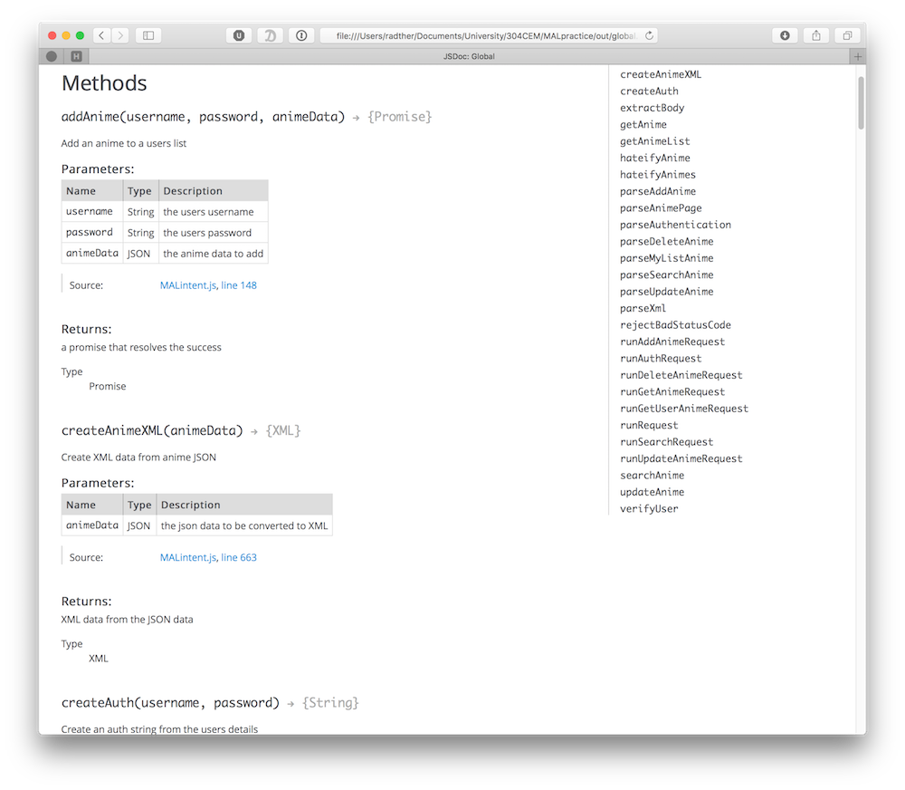
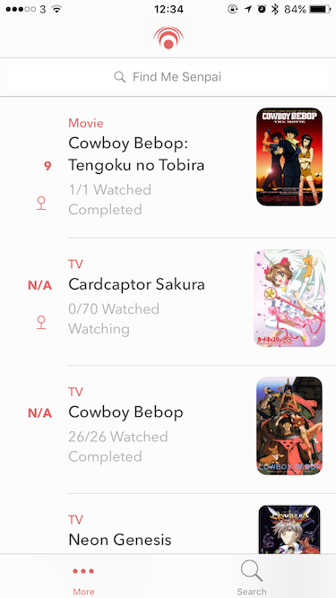
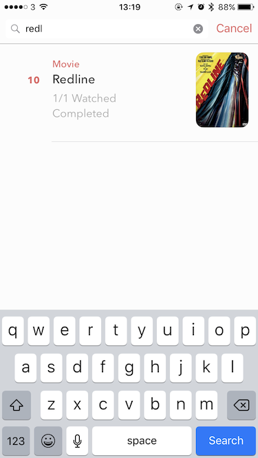
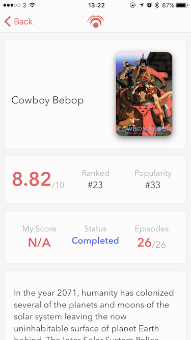
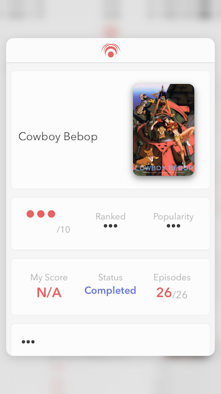

# MyAnimeList API

This is the repository for my WebAPI (304CEM) university module. The API connects to the MyAnimeList website to provide anime data in a simple JSON format. The API makes use of screenscraping techniques to provide more data than the official API provides.

The data returned also conforms to the HATEOAS spec.

## Live Endpoint

If you want to test the API you can hit the endpoint located at: `178.62.13.212:8081`.

## Setup

Little setup is required to use the project. First you need to clone the repo. Then make sure you have node installed. After that run the npm install command to install all of the required repositories.

```
npm install
```

## Tests

The tests make use of the Jasmine module as well as a few other modules to perform. These modules should be installed automatically through the `package.json` files `devDependencies` object when the `npm install` command is run.

Once the dependancies are installed, start the server with:

```
node start index.js
```

and run the test suite:

```
npm test
```

To see the test coverage run:

```
npm run coverage
```


## Documentation

All the functions in the modules are commented using documentation commments. This allows JSDoc to generate HTML documentation. This can be done by running:

```
./node_modules/.bin/jsdoc file-to-document-here.js
```

Which will generate documentation that looks like this:

This is extremely helpful as it makes it easier to use the functions you have wrote.

## Video

If you want to see more details about the project check out the video [here]().


## Client

The API also features an iOS client to show of it's features. The client makes use of the API to present a users detail in a simple and elegant way. The app uses the `/mylist` route to populate the main screen of the app:



The app then makes use of the `/anime` route with a query parameter to search the anime database:



When you have found the anime that you want you click it to get to the detail screen, which uses the `/anime` route with a url parameter for the anime wanted:



The app also makes use of iOS paradims to make a truley native experiance, such as peek and pop:



To see more about the client see the video [here](https://www.youtube.com/watch?v=KabkOLl_ZZg).